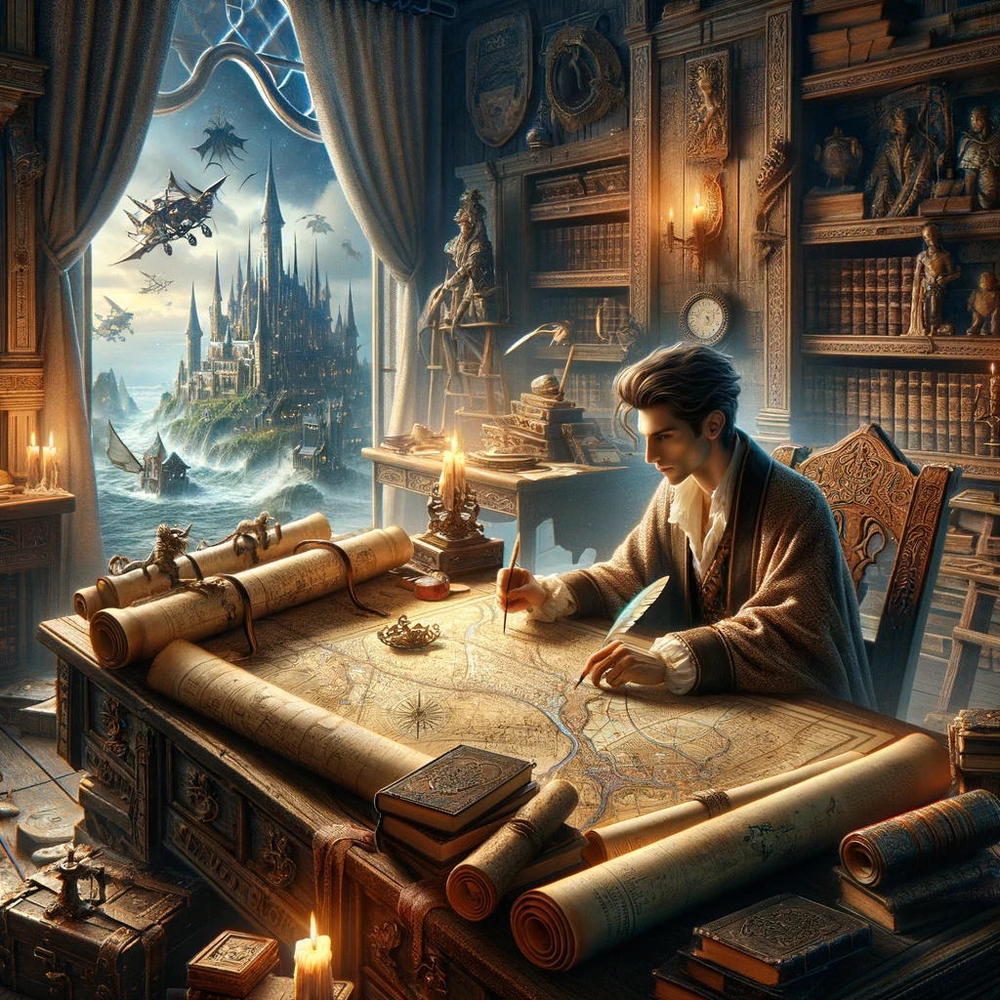
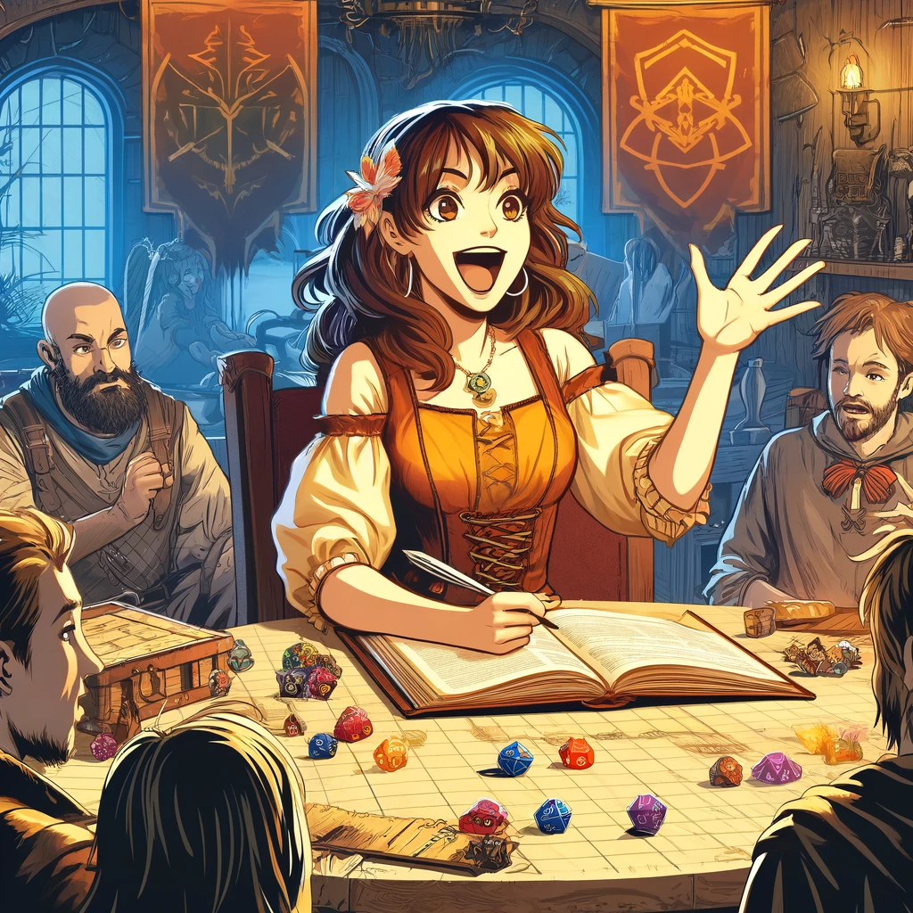
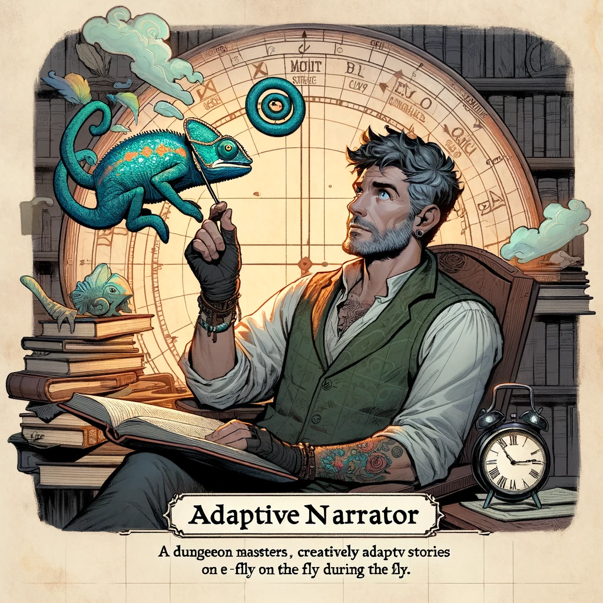

In the realm of Dungeons & Dragons (D&D), the role of a Dungeon Master (DM) can be as daunting as it is thrilling. As someone who has navigated the intricate paths of both playing and mastering D&D over the years, I have witnessed firsthand the evolution of this beloved game. The challenges of mastering D&D, especially for novices, can be substantial—from grasping the extensive rules to orchestrating a seamless and engaging narrative. This high barrier to entry can deter potential enthusiasts from fully experiencing the imaginative depths of this tabletop role-playing game (TTRPG).

However, the integration of Generative Artificial Intelligence (Gen AI) into D&D offers a promising frontier to explore. In a previous exploration, which you can read about in another post on this blog, I delved into how AI can act as a storytelling companion, transforming narrative creation and character interaction during game sessions. Building on that foundation, my latest research investigates further the role of AI in reducing the complexities involved in D&D, specifically focusing on novice DMs. This study was conducted through a structured workshop where participants interacted with AI tools to enhance their narrative development, character creation, and world-building skills.

The aim was clear: to explore how Gen AI could make the game more approachable and enrich the experience for all players, particularly those who might feel overwhelmed by the traditional demands of DMing. By lowering these barriers, we can open up the magical world of D&D to a broader audience, inviting more creativity and diversity into the fold. This post shares insights from this new research, shedding light on how novice DMs can leverage AI not just as a tool, but as a collaborator in crafting captivating D&D adventures.

Join me as we dive into the details of the workshop, analyze the distinct user profiles that emerged, and discuss both the challenges and the transformative benefits of AI integration in D&D. Whether you are a seasoned DM or a curious newcomer, the findings from this study offer valuable perspectives on the evolving role of technology in the art of storytelling and game preparation.

## The DM Workshop: Training Novice DMs with AI

To explore the potential of generative AI in Dungeons & Dragons, especially for those new to the role of Dungeon Master, we conducted a comprehensive workshop. The goal was straightforward: familiarize novice DMs with AI tools that could assist them in the various aspects of game preparation and execution. This hands-on workshop was not only about demonstrating the tools but also about engaging participants in using these technologies to craft their own D&D sessions.

### Setting the Stage

The workshop was designed with a dual focus: to educate and to empower. We invited a group of participants with varying levels of experience in D&D, from complete novices to those who had played a few sessions. This mix ensured that the insights gained would reflect a wide range of perspectives, which is crucial when assessing the accessibility of new tools. Each participant was introduced to several AI platforms, including ChatGPT, D&D Beyond, and other specialized tools for encounter generation and narrative development.

### The Workshop Structure

The session kicked off with a primer on the basics of D&D, tailored especially for those with little to no experience. This introduction covered everything from the rules of the game to the responsibilities of a DM, setting a solid foundation for the practical exercises to follow. Participants were then guided through the process of using AI tools to create elements of a D&D campaign, such as developing characters, plotting story arcs, and designing encounters.

Each participant was equipped with a digital toolkit, which included access to AI applications and resources for campaign planning. The idea was to make the learning process as interactive and engaging as possible, allowing for immediate application of the tools in a supportive environment.

### Hands-on Engagement with AI

As the workshop progressed, participants were tasked with creating their own one-shot campaigns using the AI tools. This exercise served multiple purposes: it allowed participants to directly experience the utility of AI in simplifying complex aspects of DMing, it encouraged creativity within the structured parameters of the game, and it provided immediate feedback on the effectiveness of the tools in real-time use.

This approach helped demystify the process of integrating technology into traditional game settings and highlighted the practical benefits of AI in enhancing narrative depth and simplifying logistical preparations. The session was interspersed with discussions where participants could share their experiences, challenges, and successes, fostering a collaborative learning atmosphere.

This part of the workshop was crucial in demonstrating how AI can serve as a powerful ally to DMs, especially those who might otherwise feel overwhelmed by the scale and depth of traditional D&D gameplay. The insights gained here were instrumental in understanding how different user profiles interacted with the technology, paving the way for a more nuanced discussion on the specific challenges and benefits experienced by the participants.

## Observations and Notable Moments

The workshop provided a unique vantage point to observe how novice Dungeon Masters interact with generative AI tools in real-time. Here are some of the standout observations and significant moments that highlighted the evolving relationship between AI and D&D gameplay.

### Immediate Impact of AI on Novice DMs

One of the most notable observations was the immediate impact that AI tools had on reducing the initial intimidation felt by new DMs. Participants expressed a noticeable relief when they discovered how AI could simplify complex aspects of game preparation, such as generating coherent storylines or creating detailed character backstories. This was particularly evident when participants used AI to fill in gaps in their knowledge or to provide creative suggestions that they hadn't considered.

For example, one participant, initially overwhelmed by the task of creating a villain's motive and tactics, used an AI tool to generate a backstory and strategic behaviors for their antagonist. The AI not only offered a detailed narrative but also aligned it with the thematic elements of the participant's chosen plot, demonstrating the tool's capacity to understand and integrate specific storytelling elements.

### Enhancing Creative Confidence

Another significant moment was witnessing the growth in creative confidence among the participants. As they interacted more with the AI tools, they became more adventurous in their storytelling and more ambitious in the complexity of the scenarios they crafted. This was likely due to the safety net that AI provided; knowing that they could rely on AI to assist with certain aspects of the game allowed them to explore creative ideas that they might have otherwise avoided.

For instance, a participant who had never DM'd before used AI to design a multi-layered puzzle for their dungeon. The AI not only suggested the mechanics of the puzzle but also how it could be integrated into the broader narrative, encouraging the participant to think about how each element of their campaign could be interconnected and meaningful.

### Collaborative Dynamics and AI

The workshop also highlighted the potential of AI to foster a collaborative environment among the DMs. Participants were encouraged to share their AI-generated content with others, leading to group discussions that enhanced everyone’s understanding and appreciation of the game's possibilities. This collaboration was particularly fruitful when it came to refining the AI’s suggestions, as participants could critique and improve upon the ideas presented, melding human creativity with AI efficiency.

For example, during a group session, one participant shared a character concept generated by AI. The group collectively expanded on this concept, discussing potential arcs and conflicts that could enrich the character's role in the story. This process not only improved the character but also provided a deeper learning experience for the participants, illustrating the collaborative potential of AI in creative settings.

## Understanding Different DM Styles

The workshop not only provided a hands-on experience with AI tools but also illuminated the diversity of approaches taken by novice Dungeon Masters when integrating AI into their storytelling. Through detailed observation and interaction, three distinct user profiles emerged, each representing a unique way of leveraging AI to enhance the D&D experience. These profiles offer valuable insights into the varied needs and preferences within the DM community.

### The Creative World Builder

The first profile that became apparent was the "Creative World Builder." These individuals are deeply invested in the intricacies of the game's setting and lore. They relish the opportunity to construct detailed worlds filled with rich histories, elaborate cultural norms, and complex geopolitical dynamics. During the workshop, these DMs used AI tools primarily to flesh out the layers of their worlds. They would input basic ideas into the AI, which would return with expanded concepts, detailed environmental descriptions, and historical backstories that added depth and authenticity to their settings.

*this image was generated using GPT-4

One memorable instance involved a participant who wanted to create a city that was a central trading hub but also had a hidden underworld. Using AI, they were able to quickly generate a complex network of merchant guilds and secret societies, complete with histories and conflicts that they could then weave into the fabric of their campaign. This user appreciated how AI could instantly provide a breadth of creative details that would have taken hours to develop independently.

### The Interactive Storyteller

The second profile is the "Interactive Storyteller," for whom D&D is a platform for character-driven narratives and dynamic story arcs. These DMs focus on the emotional journey of their characters and the dramatic interactions between them. In the workshop, they utilized AI to develop deep, multifaceted personalities for their characters and to script potential dialogue that would bring these figures to life in emotionally resonant ways.

*this image was generated using GPT-4

Interactive Storytellers often experimented with AI to create scenarios that could adapt based on player decisions, enhancing the game's interactive nature. For example, one DM used AI to outline a scenario where players' choices would directly influence the outcome of a political rivalry, with the AI providing several potential branches that the story could take depending on the players' actions.

### The Adaptive Narrator

The final profile identified was the "Adaptive Narrator," characterized by a flexible approach to storytelling. These DMs are adept at shifting narrative styles to suit different themes and player groups. They are particularly skilled at improvisation, often tweaking the narrative on the fly. During the workshop, Adaptive Narrators used AI to generate quick plot ideas, dialogue snippets, and setting descriptions that they could easily modify to fit the changing direction of the game.

*this image was generated using GPT-4

Adaptive Narrators valued AI for its ability to support spontaneous game development. In one session, an Adaptive Narrator was able to craft an impromptu side quest using AI-generated content, which seamlessly integrated into the main storyline and provided an unexpected twist that delighted the players.

Overall, each of these profiles represents a different set of values and approaches to the role of Dungeon Master, highlighting the diverse applications of AI in enhancing the D&D experience. Understanding these profiles helps in designing AI tools that are more tailored to the specific needs of various types of DMs, ensuring that the technology is useful, user-friendly, and enhances the creative process rather than overshadowing it.

## Challenges and Benefits of AI Integration

While the workshop illuminated the vast potential of AI in enhancing the Dungeons & Dragons experience for novice DMs, it also brought to light several challenges that participants faced when integrating these tools into their game preparation and storytelling. Understanding these hurdles is essential for refining AI tools to better meet the needs of DMs.

### Navigating AI's Learning Curve

One of the primary challenges encountered by participants was the learning curve associated with using AI tools effectively. Despite the intuitive design of some applications, novice DMs often struggled with understanding how to formulate prompts that would yield useful and relevant outputs from AI. This was particularly evident in scenarios where DMs sought to create complex narrative elements or detailed character backstories.

For example, participants occasionally received outputs that were tangentially related to their queries but did not directly address their specific needs. This issue often stemmed from a lack of familiarity with the nuances of interacting with AI, such as how to use keywords effectively or how to guide the AI to remain within the desired thematic boundaries.

### Ensuring Content Relevance and Quality

Another significant challenge was the relevance and quality of AI-generated content. While AI often provided creative suggestions and rapid content generation, the output sometimes lacked the depth or specificity that DMs needed. Participants noted instances where generated narratives or character details felt generic or not sufficiently tailored to fit the unique aspects of their created worlds.

This challenge was particularly pronounced in complex world-building exercises, where DMs sought to infuse their settings with intricate details that aligned with specific cultural or historical themes. The generic nature of some AI responses highlighted the need for more sophisticated AI models capable of understanding and integrating more complex layers of narrative detail.

### Balancing Creativity and Automation

Participants also grappled with finding the right balance between leveraging AI for efficiency and maintaining their own creative input. There was a palpable tension between the desire to use AI to simplify tasks and the fear of over-reliance on technology, which might diminish the personal touch that defines a great D&D campaign.

This challenge was evident in discussions about AI’s role in the creative process, where some DMs expressed concern that using AI might lead them to rely too heavily on generated content, potentially stifling their own creativity and reducing the personalized nature of storytelling.

### Benefits of AI Integration

Despite these challenges, the integration of AI tools also offered significant benefits, which were universally recognized among the workshop participants. AI greatly enhanced the accessibility of D&D for novice DMs by simplifying complex aspects of game preparation, such as rule management and scenario building, making it easier for newcomers to step into the role of DM.

Moreover, AI tools facilitated a higher level of creativity by providing a wealth of ideas and suggestions that DMs could adapt and build upon. This was especially helpful during brainstorming sessions, where AI-generated prompts and scenarios sparked creative thought and helped DMs develop richer, more engaging storylines.

Additionally, the use of AI allowed for a more dynamic gameplay experience, where story elements could be quickly adjusted based on players’ actions and decisions, enhancing the interactive and responsive nature of campaigns.

### Moving Forward

Understanding these challenges and benefits is crucial for future developments in AI integration within D&D. The insights gained from this workshop will guide the refinement of AI tools, ensuring they are more user-friendly, context-aware, and capable of supporting DMs in crafting deeply personalized and engaging game experiences. This balance of technology and human creativity is the cornerstone of the next generation of TTRPG gameplay, where AI acts not just as a tool, but as a partner in the creative journey.

## Future Directions and AI Tool Development

The findings from our workshop have laid a solid foundation for the next steps in integrating AI into Dungeons & Dragons, particularly in the development of AI tools designed to enhance the DM experience. Our discussions and the challenges faced have highlighted key areas for improvement and innovation, which will inform the ongoing development of AI applications in TTRPGs.

### Enhancing AI Responsiveness and Relevance

One of the primary future directions is to enhance the responsiveness and relevance of AI outputs. Building on the current capabilities of AI, the next generation of tools will need to incorporate more advanced natural language understanding and generation algorithms. These improvements will help ensure that AI-generated content is not only contextually appropriate but also rich in detail and aligned with the specific creative directions and styles preferred by DMs.

### DnD.AI: A Conceptual AI Assistant

A significant outcome of this research is the conceptualization of DnD.AI, an AI assistant specifically tailored for use in Dungeons & Dragons. Envisioned as a robust support tool for DMs, DnD.AI aims to streamline the game preparation process and enhance narrative development, character creation, and world-building.

DnD.AI is designed to be intuitive and user-friendly, providing DMs with seamless assistance during game sessions. Whether it's generating detailed character backstories on the fly, suggesting plot twists, or creating dynamic encounters based on player actions, DnD.AI will be equipped to handle a variety of tasks that traditionally require significant time and effort.

### Collaborative Development and User Feedback

Moving forward, the development of DnD.AI will involve a collaborative process with ongoing input from a diverse community of DMs and players. This approach ensures that the tool not only meets the practical needs of users but also enhances their creative experiences. Feedback loops from regular user testing sessions will be crucial in refining DnD.AI’s functionalities and ensuring that it aligns with the users' preferences and gaming styles.

### Expanding AI Integration Research

Additionally, future research will focus on expanding the integration of AI into various aspects of D&D gameplay. This includes exploring how AI can be used to facilitate player interaction, support live story adaptation, and enhance engagement through immersive audio-visual elements. Research will also explore the ethical implications of AI in gaming, ensuring that its use respects player agency and enhances the overall game experience without diminishing the human elements that are central to TTRPGs.

### Broader Implications for TTRPGs and Creative Storytelling

The insights and technologies developed from integrating AI into D&D can also inform broader applications in other TTRPGs and creative storytelling platforms. By advancing our understanding of how AI can support complex narrative development and user interaction, we can pave the way for innovative uses of AI in entertainment, education, and beyond.

## Conclusion

The journey from conceptualizing to practically implementing AI tools like DnD.AI in Dungeons & Dragons encapsulates the dynamic interplay between technology and traditional gaming. As we continue to explore and refine these tools, we embrace a future where AI not only supports but enhances the creative storytelling that lies at the heart of TTRPGs. With DnD.AI and similar innovations, we move closer to a world where anyone, regardless of their experience level, can step into the role of Dungeon Master and lead adventures that are as boundless as their imagination.