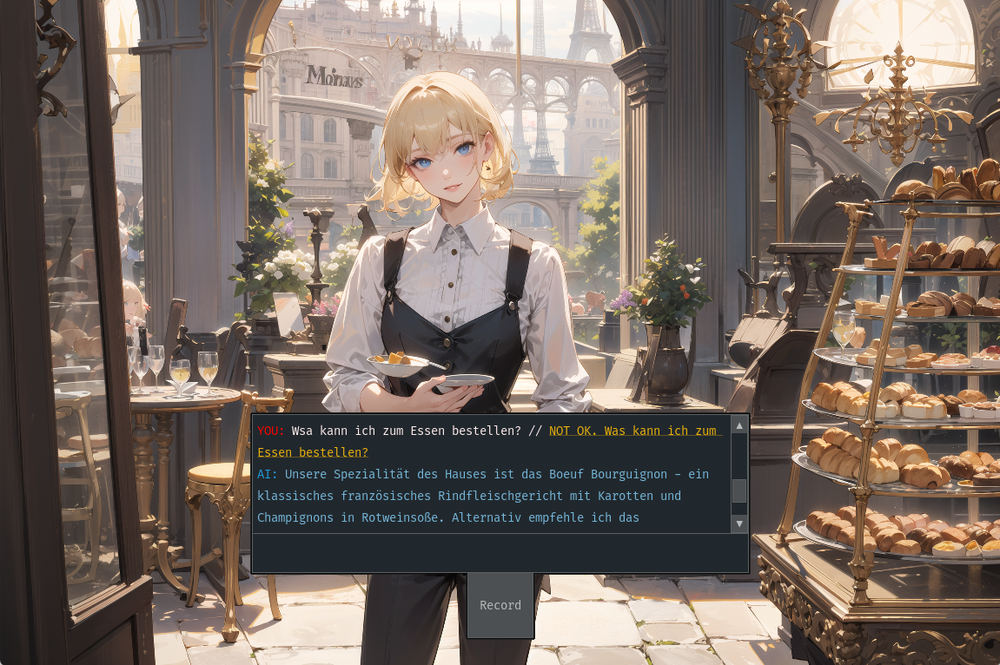

In the rapidly evolving world of education technology, the integration of artificial intelligence (AI) into language learning has opened new horizons that were once the realm of science fiction. As a someone who recently moved to a different country, I wanted to explore how I can make learning the native language as easy as possible. Which is why I turned to generative AI with the goal of transforming the way we learn languages. This curiosity led me to others who felt the same way, and we decided to take a crack at developing a prototype specifically designed to enhance the process of Second Language Acquisition (SLA).

Our research aimed to create a more adaptive and personalized learning environment, leveraging the capabilities of generative AI to cater to the unique needs of each learner. By iteratively refining our prototype and incorporating feedback from actual users, we were able to tailor the experience in ways traditional methodologies could not achieve. This blog post is a reflection on our research journey, the insights we gained, and the profound impact of generative AI on language education. It is written for fellow researchers, educators, technology enthusiasts, and anyone curious about the future of educational technologies.

## The Power of Generative AI in Language Learning

The core of our research was to harness the potential of Intelligent Computer-Assisted Language Learning (ICALL), a domain that traditionally relies on digital tools to facilitate language education. However, despite the advancements, many of these tools remained rigid, offering little in the way of personalization. This is where generative AI, particularly large language models like GPT-4, steps in to redefine the educational landscape.

Generative AI brings a level of customization previously unattainable in ICALL. By analyzing vast amounts of data, these AI models can adapt to the individual learning styles and needs of users. In our study, we employed these models to create dynamic, scenario-based learning experiences that mimic real-life interactions. This approach not only makes learning more engaging but also significantly more effective by providing immediate feedback and tailored grammatical guidance.

One of the standout features of our prototype was its ability to generate prompts and responses that reflect the user's proficiency and personal interests. This capability ensured that each interaction was not just a learning opportunity, but a step towards greater linguistic competence. Moreover, the integration of generative AI allowed for a flexible learning environment where learners could practice conversations, receive corrections, and get explanations in a risk-free setting, thus reducing the anxiety often associated with speaking a new language.

The use of AI in this context is not just about linguistic practice. It extends to creating a nurturing environment where learners are encouraged to experiment and engage with the language in meaningful ways. Through the continuous refinement of our AI tools, we aimed to build a system that not only teaches but also inspires learners to explore their linguistic capabilities fully.

## Developing the Prototype

Developing a functional prototype that effectively integrates generative AI into language learning was both a challenge and an opportunity for innovation. Our objective was clear: create a tool that could simulate real-world language use scenarios, adapting dynamically to the learner's needs while providing an immersive and engaging experience.

### Technological Stack
The backbone of our prototype was a suite of advanced technologies chosen for their reliability and flexibility. We utilized OpenAI's GPT-4 for its sophisticated language processing capabilities, ensuring our conversational agent could handle a diverse range of interactions. For speech recognition, we implemented OpenAI's Whisper, which provided accurate transcription even with varied accents and speech patterns. The visual components were powered by Stable Diffusion, a text-to-image model that enriched our scenarios with contextually relevant visuals, enhancing the immersive experience.

### Challenges Faced
One of the initial challenges was ensuring the system could handle the complexity of real-time interactions without significant delays, which could disrupt the learning flow. Balancing the computational demands of generative AI models with the need for a responsive user interface required careful optimization and frequent testing.

Another challenge was the design of the user experience. We needed to make the interface intuitive enough for learners of all tech-savviness levels while maintaining the depth required for effective language learning. This led to multiple iterations based on user feedback, each refining the prototype to better meet the users' needs.

### Iterative Improvement
Feedback from initial user tests highlighted the need for more guided interaction and clearer feedback on language use. We responded by enhancing the AI's ability to provide grammatical corrections and more nuanced feedback on language nuances. Each iteration brought new insights, which we used to fine-tune both the technical performance and the educational effectiveness of our prototype.

The development process was a testament to the collaborative nature of innovative educational technology design. By incorporating continuous feedback from real users and leveraging cutting-edge AI, we were able to create a prototype that not only teaches but also adapts and grows according to the user's evolving needs.

## Insights from the Study

Our research involved a series of iterative UX feedback sessions with language learners, providing invaluable insights that shaped the development and enhancement of our prototype. These sessions were crucial in understanding how users interact with the technology and how it could be optimized to better serve their learning needs.

#### Key Findings
One of the most significant findings was the positive impact of scenario-based learning. Participants reported that the ability to practice language skills in varied, real-life scenarios greatly enhanced their engagement and retention. This was particularly evident in the flexibility of the conversational agent to adapt scenarios based on the learner's responses, making each session unique and personally relevant.

The integration of speech recognition and immediate feedback mechanisms proved highly effective. Learners appreciated the system's ability to recognize and correct their pronunciations and grammatical errors in real-time, which greatly accelerated their learning curve. Additionally, the text-to-image capabilities provided by Stable Diffusion added a visual dimension to the learning process, making interactions more engaging and easier to understand.

#### Iterative Enhancements
Feedback from the participants also highlighted areas for improvement. Early versions of the prototype were criticized for their lack of intuitive user guidance and for the robotic quality of the text-to-speech responses. To address these issues, we implemented a more natural-sounding speech synthesis and enhanced the user interface for greater ease of use.

Throughout the three study iterations, we observed a marked increase in the confidence levels of participants when using the language in practical situations. This boost in confidence, coupled with the tailored learning approach, underscored the effectiveness of integrating generative AI into language learning tools.

### User-Driven Changes
Based on user feedback, we made several critical enhancements:
- **Enhanced Interactivity**: We improved the AI's interactivity by programming it to ask follow-up questions, encouraging learners to think and respond more deeply.
- **Visual and Auditory Feedback**: Adjustments were made to provide clearer visual cues and more responsive auditory feedback to guide users through their learning journey.
- **Customization Features**: We introduced more customization options, allowing users to adjust the difficulty levels and choose specific language focus areas.

These insights not only demonstrated the prototype’s potential but also highlighted the dynamic nature of AI-driven education, where user input directly influences the evolution of the learning tool.

## Future Directions and Applications

As we reflect on the outcomes of our study and look forward to the future of language learning technologies, it is clear that the potential applications of our research extend well beyond the confines of our initial prototype. The integration of generative AI into educational tools can revolutionize not only language learning but also various other aspects of personalized education.

### Broadening the Impact
In the near term, we aim to expand the capabilities of our prototype to support more languages and dialects, thereby reaching a more diverse global audience. This expansion will involve refining our AI models to better understand and process a wider range of linguistic nuances, which is essential for providing a truly inclusive educational experience.

Another direction is the integration of our technology into formal educational settings, such as schools and language institutes. By partnering with educational institutions, we can tailor our tool to fit into existing curriculums, enhancing the traditional learning experience with our AI-driven approach.

### Technological Advancements
Looking further ahead, we are exploring the use of augmented and virtual reality to create even more immersive language learning environments. These technologies can simulate real-world interactions in a controlled setting, making language practice even more engaging and effective.

We also plan to enhance the AI’s responsiveness and emotional intelligence. By developing models that can understand and react to the emotional state of learners, we can provide support that is not only linguistically accurate but also empathetically aligned with the learner's feelings and needs.

### Research and Collaboration
Continued research into the effectiveness of AI in education will be vital. We intend to collaborate with other researchers and institutions to explore new uses for generative AI in educational contexts, share knowledge, and develop best practices.

Furthermore, the feedback mechanisms and data analysis capabilities of our system offer rich insights into language acquisition processes, which can contribute to broader academic research in linguistics and cognitive science.

## Conclusion

Reflecting on the journey of this research project, from its conception to the multiple iterations of our prototype, it's clear that the integration of generative AI into language learning represents a significant step fo   rward in educational technology. Our work has not only demonstrated the potential of AI to create personalized and immersive learning experiences but also highlighted the adaptability and scalability of these technologies in meeting diverse learner needs.

Our study has laid a solid foundation for future exploration and development in the field of Intelligent Computer-Assisted Language Learning (ICALL). By continuously refining our prototype based on user feedback and advancing our understanding of AI's capabilities, we can further enhance the effectiveness of language education. This process has taught us the importance of being responsive to the needs of learners and the transformative potential of incorporating AI into educational frameworks.

As we move forward, our goal is to not only improve upon the existing technology but also to innovate in ways that push the boundaries of what educational tools can achieve. The enthusiasm and positive feedback from our study participants inspire us to continue our work, ensuring that the benefits of generative AI reach as many learners as possible.

In closing, I invite educators, technologists, and learners worldwide to engage with this research. Whether by providing feedback, participating in further studies, or simply exploring the use of AI in education, your contributions are invaluable in shaping the future of learning.
