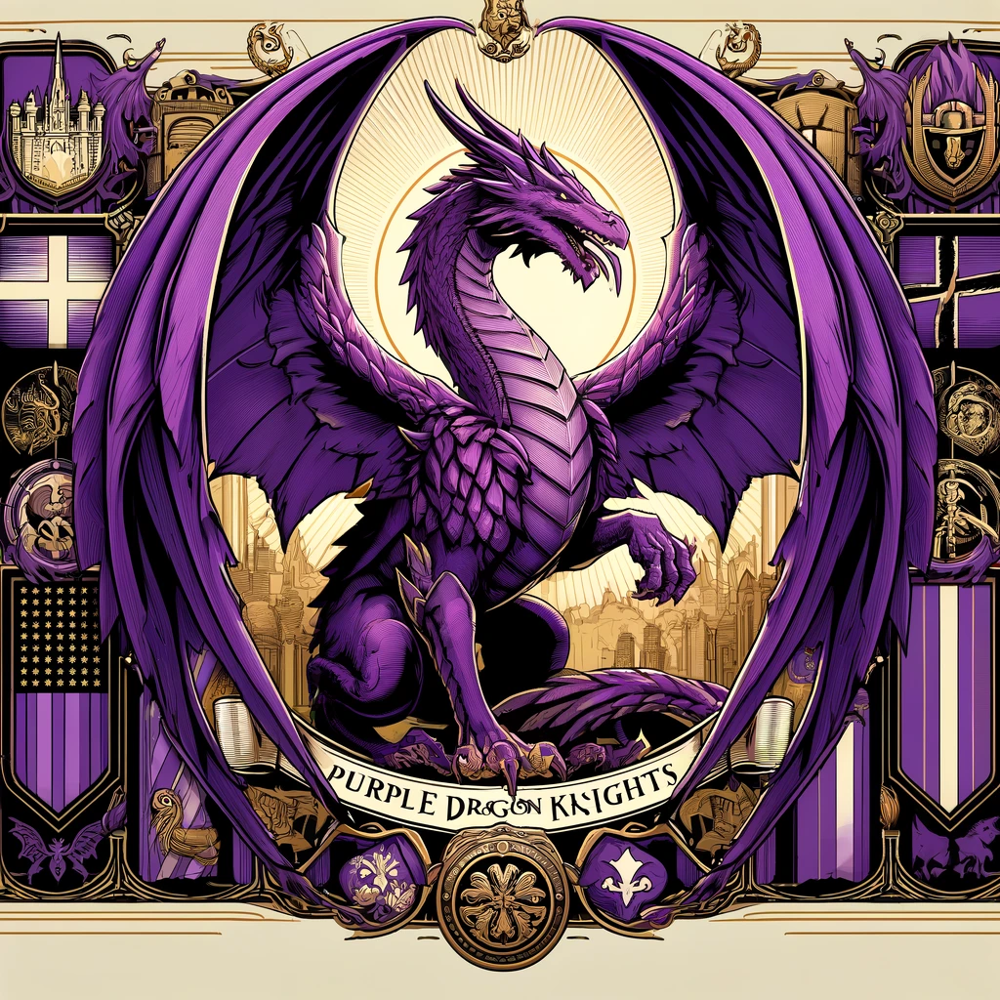
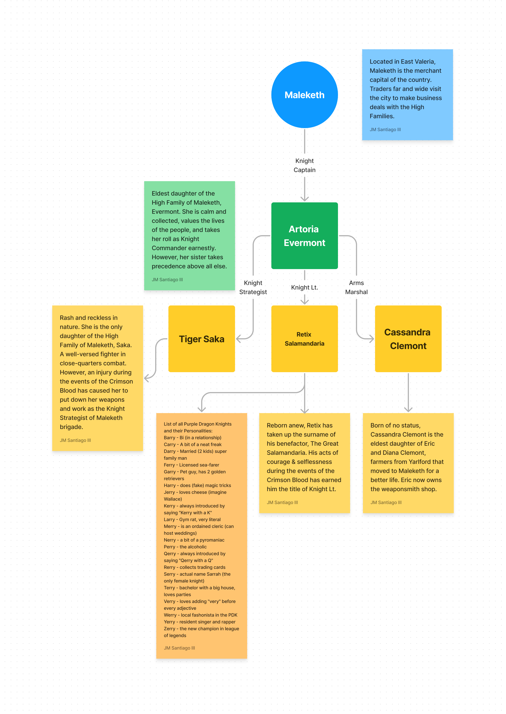
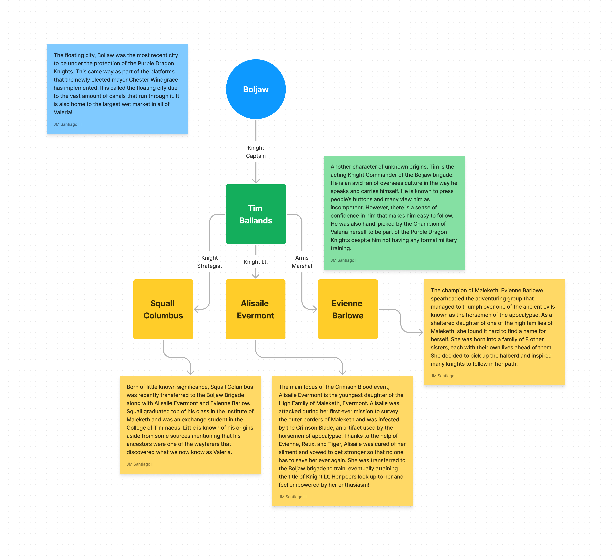

## The Purple Dragon Knights

In the kingdom of Valeria, there exists a noble and chivalrous order known as the Purple Dragon Knights. This esteemed order was founded many centuries ago in honor of the ancient dragon Reigedyrth, who had aided the late Queen Valeria in her quest to unify the kingdom.

The Purple Dragon Knights are known throughout the land for their bravery, honor, and fierce loyalty to the kingdom. They are responsible for maintaining the peace and security of the most important cities in Valeria, and are known to be fierce defenders of the realm.

Each major city in Valeria has a brigade of Purple Dragon Knights, led by a Knight Captain who oversees its activities. The brigade is further divided into three sections, each led by a Knight Lieutenant, Marshal-at-Arms, and Knight Strategist, who all report to the Knight Captain.

The Knight Captains of the Purple Dragon Knights are some of the most respected and revered figures in the kingdom. They are chosen from the most skilled and accomplished knights in the land, and are renowned for their valor, wisdom, and unwavering devotion to duty.

**In Maleketh**, the Knight Captain is Lady Artoria Evermont, a seasoned warrior who commands the respect of his troops and the merchants who benefit from their protection. 

She is supported by her trusted Lieutenant, Sir Retix Salamandria, the Marshal-at-Arms, Lady Cassandra Clemont, and the Knight Strategist, Lady Tiger Saka. The Maleketh brigade is known for its effectiveness in handling mercantile disputes, which can sometimes escalate into violent conflicts.

**In Timmaeus**, the headquarters of the Order, is split into two brigades: Upper and Lower Timmaeus. Starting with the Upper brigade, the Knight Captain is Sir Blythe Silvercrest, a stern and disciplined knight who upholds the traditions of the Order with an iron fist. His subordinates include Lieutenant Alexander Morcent, Marshal-at-Arms Sir Charles d’Arthur, and Knight Strategist Sir Merlin IV. 

On to the Lower brigade, the Knight Captain is Sir Cade Silvercrest, a master of artillery who rose through the ranks with his unyielding dedication to protecting Valeria. His subordinates include Lieutenant Tusk of the Mighty Frost, Marshal-at-Arms Sir Lukas Longgo, and Knight Strategist Lady Noelle Chevron. The Timmaeus brigade is responsible for the security of the city and the College of Timmaeus, and they also work closely with the Mighty Frost to maintain the peace in the frozen north-west.

**In Boljaw**, the Knight Captain is Sir Timothy Ballands, an eccentric but charismatic knight who commands the respect of his troops and the admiration of the canal-dwellers. 

The brigade is composed of elite warriors, and is supported by Lieutenant Alisaile Evermont, Marshal-at-Arms Lady Evienne Barlowe, and Knight Strategist Sir Squall Columbus. The Boljaw brigade is known for their prowess in naval battles, and they also work to keep the peace between the various canal-dwelling factions.

Finally, **in Yarlford**, each title is currently unoccupied due to the absence of the Champion of Valeria, who decides who is worthy of joining the order of the Knight Captains.

The Purple Dragon Knights are not merely soldiers or guards, but rather, an embodiment of the highest ideals of chivalry and honor. They hold themselves to the most rigorous standards of conduct, and are bound by a strict code of ethics and principles.

The people of Valeria look up to the Purple Dragon Knights as exemplars of courage, loyalty, and justice. Many aspire to join the order, and train their entire lives to become worthy of such an honor.

Though they are few in number, the Purple Dragon Knights are a formidable force, capable of standing against any threat that might arise. They are the protectors of the realm, and their dedication and bravery are a source of inspiration and hope to all who call Valeria their home.

## The Felgrand Syndicates

1. **Coalition of the People** - This syndicate is unique in that it offers basic support to the people of Felgrand, akin to that of a traditional government. The Coalition of the People is led by a council of representatives from various walks of life, and its goal is to ensure that the needs of the city's citizens are met. The Coalition is often viewed as a necessary evil by the other criminal syndicates, as its power and influence gives it a measure of control over the city's population. However, the Coalition's leaders are determined to use their influence for the greater good, even if it means making difficult and unpopular decisions.
2. **Arachnid’s Fang** - This syndicate is known for its ruthlessness and efficiency, and for its ironclad grip on the city's mercenary guild. The Arachnid's Fang is named for its leader, an enigmatic figure known only as the Spider Queen. Under her guidance, the syndicate has become a powerful force within Felgrand's criminal underworld, providing skilled mercenaries and assassins to the highest bidder. Those who cross the Spider Queen or her minions do so at their own peril, for the Arachnid's Fang is swift to deliver its venomous justice.
3. **Legio Ferrum** - This syndicate is responsible for training soldiers and building armies in the style of ancient Rome. The Legion Ferrum is highly organized and disciplined, and its members are known for their ironclad loyalty and unswerving dedication to duty. The legion is led by a stern and uncompromising figure known as the Iron General, who is feared and respected by all who serve under him.
4. **Copper Crown Consortium** - This syndicate oversees the city's merchants guild and wields immense power over Felgrand's economy. The Consortium is known for its shrewd business sense and its willingness to use any means necessary to achieve its goals. The Consortium's leader, a wily and cunning figure known as the Copper King, is feared and respected in equal measure, and those who cross him are often left penniless and destitute.
5. **The Machinist Union** - The union is a powerful and respected organization that is at the forefront of steampunk technology. The union was founded by the Felgrand family, and it has been instrumental in driving the city's technological advancements. As a neutral entity, the union has managed to avoid becoming embroiled in the power struggles of the other criminal organizations, though its leaders must constantly navigate a complex web of alliances and betrayals to maintain the union's position of power and influence.

## High Families of Maleketh

The High Families of Maleketh are among the wealthiest and most influential clans in all of Valeria. They have a long history of power and authority, having been responsible for the growth and prosperity of the city for generations. Each family has their own specialty and expertise, with a network of loyal servants and workers who ensure their success and dominance over their respective industries.

1. **The Barlowe family** is one of the most respected and renowned families in Maleketh, responsible for the delivery of goods across the country. They have a vast network of couriers and carriers who traverse the dangerous roads and routes, ensuring that Maleketh remains well-stocked and prosperous. The Barlowe family is also known for their expert craftsmanship in the creation of carriages, wagons, and other transportation methods.
2. **The Megadome family** is responsible for the city's infrastructure, including the construction and maintenance of public buildings, roads, and bridges. They have an army of skilled workers and engineers who work tirelessly to keep the city functioning efficiently. The Megadomes are known for their mastery of stonework and architectural design, with their signature domed structures dotting the Maleketh skyline.
3. **The Evermont family** has controlled the distribution of wine and alcohol in Maleketh for generations, making them one of the most lucrative families in the city. They have vast vineyards and wineries across the region, producing the finest wines and spirits that are highly sought after by the nobility and wealthy patrons of Maleketh. The Evermonts are also known for their extravagant parties and events, always featuring the finest beverages and cuisine.
4. **The Saka family** owns the food and hotel industry, with their luxurious establishments catering to the elite of Maleketh. Their restaurants, inns, and taverns are known for their exquisite cuisine and lavish accommodations. The Sakas have a network of farms and ranches that supply their establishments with the freshest ingredients, ensuring the highest quality of food and service.

Together, the High Families of Maleketh hold immense power and influence, each controlling a vital aspect of the city's economy and society. Their wealth and resources make them both admired and feared, and they are always seeking to expand their reach and maintain their position of dominance in the region.

### The Hunting Guild
In the small town of Taloncroft, on the border of Felgrand and Maleketh, a brave guild of hunters resides. They are known as the Talon Hunters, and their legend is known throughout the land.

These hunters are a group of skilled warriors, known for their bravery and their unwavering commitment to the safety of Taloncroft and its people. They hunt down dangerous beasts, witches, undead, and other monstrosities, and show no mercy to any prey that threatens the safety of the town.

The Talon Hunters are led by a council of elders, who are responsible for guiding the guild and making important decisions. These elders are the most experienced and respected hunters in the guild, and their knowledge and wisdom are greatly valued by the members.

The hunters are famous for their leaderboard, which showcases the best hunts of all time in Taloncroft. It is a source of great pride for the hunters and the town's residents, and serves as a reminder of the guild's bravery and commitment to protecting their home.

The Talon Hunters are also known for their close-knit community, with residents who are proud of their hunters and are always willing to offer support and assistance. The guild is an integral part of life in Taloncroft, providing protection and security for the town and its people, and playing a key role in the region's trade and commerce.

In a land filled with danger, the Talon Hunters are a symbol of strength and protection, and their legend will live on for generations to come.
