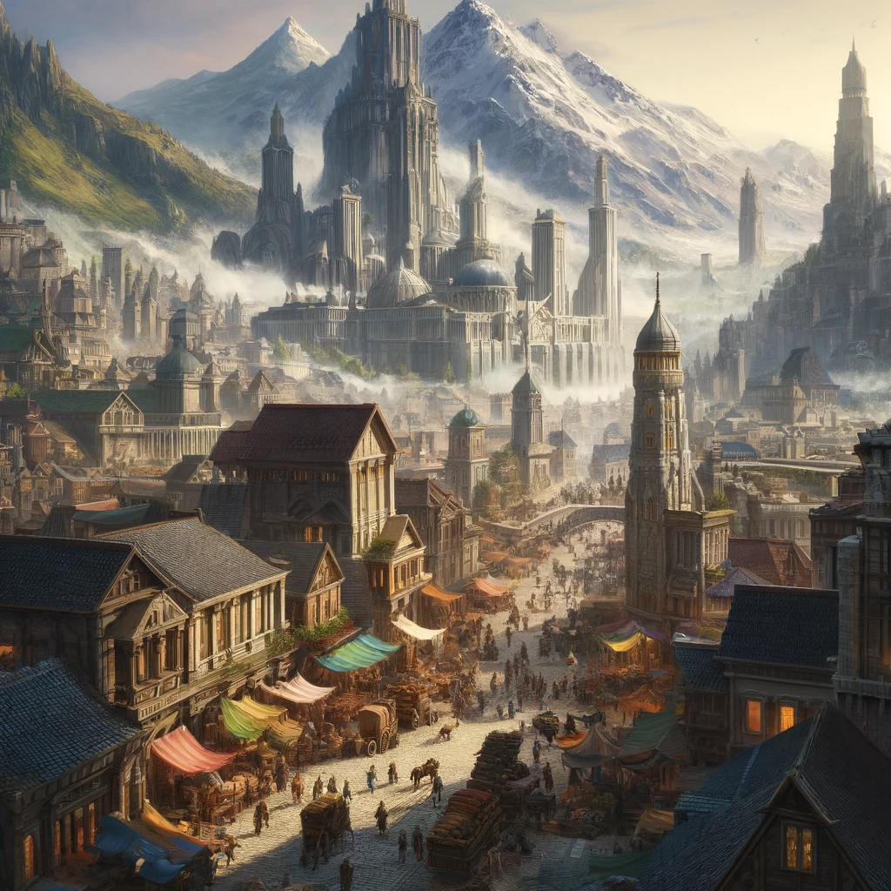
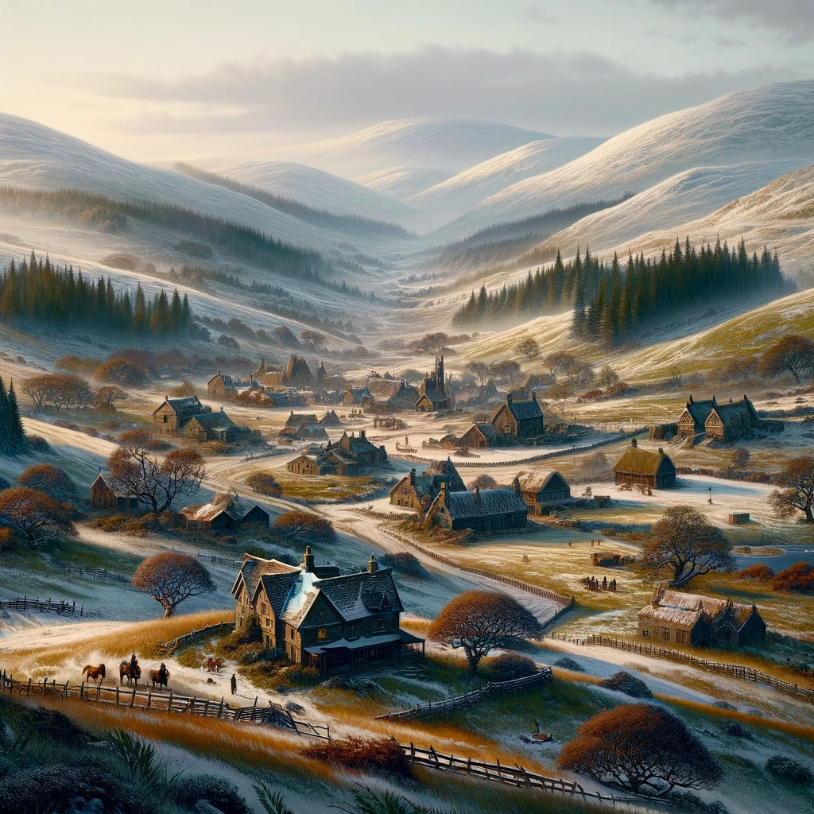

Welcome to the mystical realm of Valeria, a land where the threads of magic and the gears of technology intertwine in a perpetual struggle for dominance. This nation is starkly divided into eastern and western regions, each boasting its own distinct flavor yet contributing to the rich tapestry of the country’s diverse landscape. Here, expansive rural areas meld seamlessly with teeming urban centers, creating a striking juxtaposition between the tranquility of nature and the bustling rhythm of city life.

Valeria is home to five major cities—Maleketh, Felgrand, Timmaeus, Boljaw, and Yarlford—each with its own unique spirit and host of challenges. From the steam-powered chaos of Felgrand to the aristocratic intrigues of Maleketh, Valeria offers adventurers and denizens alike a complex world of conflict, beauty, and perpetual discovery. As one traverses this captivating country, they are met with a land alive with possibilities, dangers, and wonders, embodying the quintessential clash between the arcane and the mechanical.

## Maleketh

In the prosperous northeast of Valeria lies the bustling city of Maleketh, a place of commerce and trade where the streets are alive with the sound of merchants haggling and carts rattling over cobblestones. The city is a marvel of architecture, with tall spires and grand marketplaces that attract visitors from across the land.

At the heart of Maleketh stands Mount Doloro, the highest point in all of Valeria. It is a towering peak that looms over the city, its snow-capped summit lost in the clouds. Legend has it that the mountain is home to the Dwarven King and his sons, who rule over the mines and forges that lie deep within its rocky heart.

Maleketh is also home to the Great Colosseum, a magnificent arena that draws crowds from across the land to watch fierce battles between gladiators and beasts. The Colosseum is named after Maleketh Stallion, the great warrior who founded the city and brought it to greatness.

The people of Maleketh are a proud and prosperous lot, their fortunes built on the back of the city's thriving markets and businesses. The High Families of Maleketh are among the most powerful in all of Valeria, with the Barlowe family responsible for the delivery of goods across the country, the Megadome family overseeing the city's infrastructure, the Evermont family controlling the distribution of wine and alcohol, and the Saka family owning the food and hotel industry.

But despite the wealth and power of Maleketh, danger lurks in the shadows. The city is rife with criminal activity, with thieves and smugglers running rampant in the streets. The Purple Dragon Knights maintain a tenuous grip on the city, but their authority is often challenged by the Syndicates, a shadowy group of criminals who control much of the city's underworld.

As you make your way through the bustling streets of Maleketh, you will encounter a host of characters, from the shrewd and wealthy merchants to the cunning and dangerous criminals who seek to exploit the city's riches. You may even catch a glimpse of the Dwarven King and his sons, or venture deep into the mines and forges that lie beneath Mount Doloro.

But you must be careful, for danger lurks around every corner in Maleketh. The city may be prosperous and thriving, but it is also a place of secrets and hidden dangers, where those who seek to uncover the truth may find themselves facing deadly consequences.

## Felgrand

In the heart of Valeria, where the two great regions meet, lay the city of Felgrand. Unlike its neighboring cities, Felgrand was not ruled by a traditional government. Instead, a group of criminal organizations known as the Syndicates had taken control of the city, turning it into a hub of illicit activity.

Despite the Syndicates' iron grip on the city, Felgrand was a place of incredible innovation and progress. It was said that the Syndicates encouraged new ideas and inventions, so long as they could profit from them. And so, the city became a haven for inventors and entrepreneurs, who worked tirelessly to create new machines and gadgets to sell to the highest bidder.

As one might expect, Felgrand was also home to a thriving black market, hidden beneath the city's streets. Here, all manner of illegal goods and services could be purchased for those with the coin and the courage to seek them out. The Syndicates themselves turned a blind eye to these activities, knowing that they provided a source of income for some of their less reputable members.

But for those who were not part of the Syndicates, the black market was a dangerous and unpredictable place. It was not uncommon for newcomers to be robbed, beaten, or worse by those seeking to take advantage of their naivete. But for those who knew the right people, or had something valuable to trade, the black market could be a place of incredible opportunity, where fortunes could be made or lost in an instant.

Despite the dangers of the city, Felgrand remained a place of incredible allure and excitement. Those who lived within its walls knew that they were part of something special, a place where anything was possible, and where the rules of society could be bent or broken in pursuit of power and wealth. And so, they worked tirelessly to protect their city, to ensure that its many secrets remained hidden from the prying eyes of outsiders. For Felgrand was a city unlike any other, a place where one could truly be free, so long as they had the strength to survive.

## Timmaeus

Deep in the frozen northwest of Valeria lies the ancient city of Timmaeus, a place of wonders and mysteries shrouded in snow and ice. The city is a marvel of stonework, with great walls and towers that stand proud against the biting winds and frigid storms.

At the heart of the city looms the Skathi, the second-highest peak in all of Valeria. The mountain is a place of great power, steeped in ancient legend and lore. It is said that the Mighty Frost, a tribe of Arctic-folk creatures, call the Skathi their home, and they stand guard over the mountain with fierce devotion.

The people of Timmaeus are hardy and resourceful, their spirits forged in the crucible of the icy wastes that surround their city. They are a proud people, fiercely independent, and they chafe under the rule of the Purple Dragon Knights, who have made their headquarters in the city.

Yet, despite the harshness of their environment, the people of Timmaeus have built a thriving city, rich in culture and knowledge. The College of Timmaeus stands as a beacon of learning and enlightenment, a place where the mysteries of magic are explored and understood.

The college's halls are filled with students from all over Valeria, each seeking to unlock the secrets of the arcane. They are taught by the greatest sorcerers and mages in the land, men and women who have dedicated their lives to the study of magic.

But Timmaeus is not without its dangers. The frozen wastes that surround the city are home to all manner of beasts and monsters, and there are whispers of dark forces at work, seeking to tear the city apart from within.

As you make your way through the frozen streets of Timmaeus, you will encounter a host of characters, from the rugged and resilient residents of the city to the savage creatures that lurk in the icy wastes. You will need to use all your cunning and strength to survive the challenges that await you, maybe even an encounter with the Mighty Frost.

But if you are brave and resourceful, you may uncover the ancient secrets and treasures that lie hidden in the frozen heart of Timmaeus, and discover the true power that lies within.

## Boljaw

Boljaw, the City of Canals, is a bustling metropolis that sprawls across the tropical marshes of the southwest. It is said that a person can walk the city end-to-end and never touch solid ground, for the canals that crisscross the city are its lifeblood, and the boats that ply their waters its beating heart.

Towering above it all is the imposing Palace of Boljaw, the seat of the city's rulers. There, the Duke and his council hold court, ruling over the city with a mix of wisdom and force. For Boljaw is not a place for the weak or the timid, but rather for the ambitious and the bold.

The city is divided into three distinct districts, each with its own character and flavor. The first is the Old Quarter, where the canals are narrow and twisting and the buildings lean in upon each other, as if conspiring together. Here, the winding alleyways and twisting canals are a maze, where only the locals can find their way with ease.

The second is the New Quarter, where the canals are broad and the buildings are tall and grand. This is where the wealthy and powerful make their homes, in palaces and mansions that seem to reach up to the sky. It is a place of decadence and luxury, where every want and need can be satisfied for a price.

The third and final district is the Docklands, where the ships that bring the city its wealth are moored. Here, the smells of salt and brine mix with the sounds of commerce and the shouts of sailors. It is a place of danger, where one must always keep an eye out for cutpurses and thieves.

But Boljaw is more than just its districts and canals. It is a city of secrets and hidden treasures, where the adventurous can find untold riches and lost artifacts. It is a place of danger and opportunity, where fortunes can be made or lost in a heartbeat. And for those with the courage and the will to survive, it is a city like no other in all of Valeria.

## Yarlford

As you venture into the southeastern reaches of Valeria, the air grows cold and the landscape transforms into a vast and rugged countryside. It is here that you will find Yarlford, a humble region under the leadership of its recently elected mayor, Cleopatra Cretari.

A tiefling with striking crimson skin and glinting golden eyes, Mayor Cretari hails from a long and illustrious lineage of skilled hunters. Her ancestors were renowned for their ability to track and capture the most elusive of prey, and the people of Yarlford hope that their new mayor will continue this legacy of strength and perseverance.

Despite its relative isolation, Yarlford is not without its charms. The countryside is dotted with cozy cottages and lively marketplaces, where farmers and artisans sell their wares. The people here are hardy and resourceful, with a deep reverence for the land and its creatures.

But make no mistake – the cold and unforgiving environment of Yarlford can be dangerous for the unprepared. The deep forests are home to fierce predators and cunning bandits, and the winter snows can make travel treacherous. The people of Yarlford know this all too well, and have developed a deep respect for the strength and resilience required to survive in this wild and untamed land.

Under Mayor Cretari's leadership, the people of Yarlford hope to thrive and grow, using their unique skills and knowledge to make the most of what their rugged region has to offer. With their fierce determination and unwavering spirit, the people of Yarlford are a testament to the indomitable nature of the human spirit.