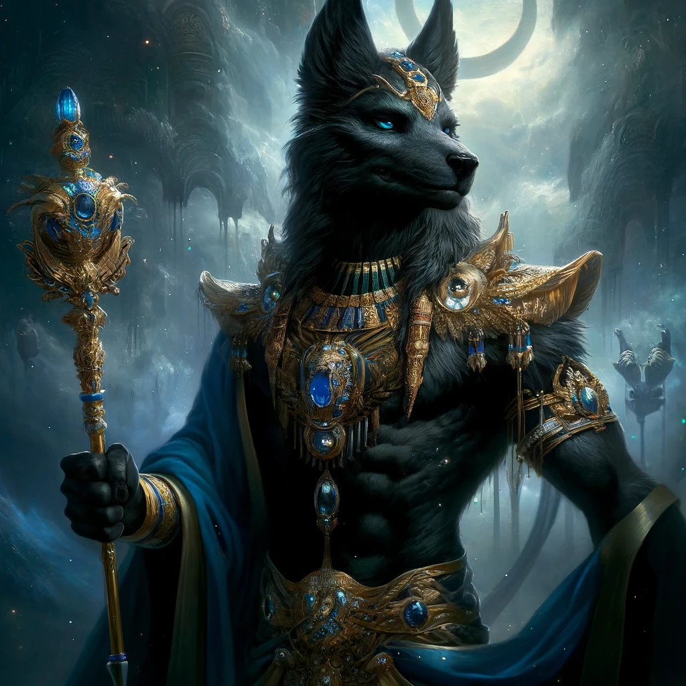
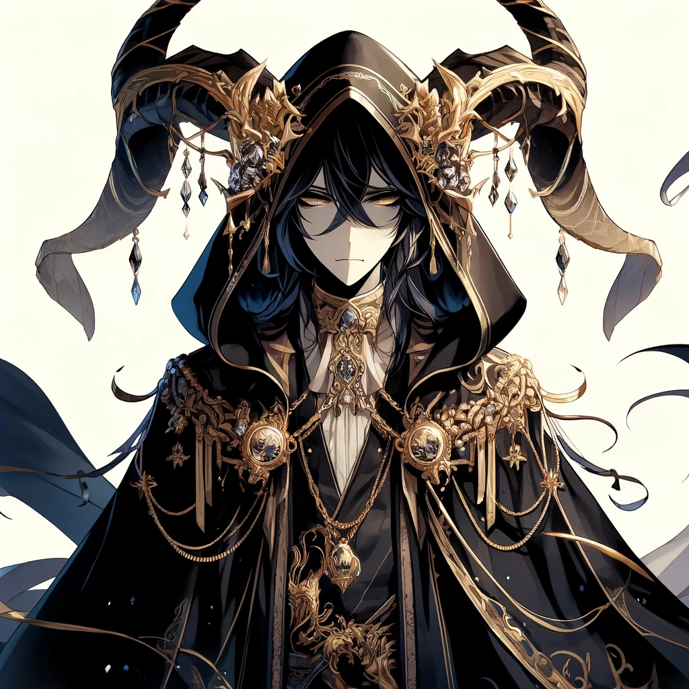
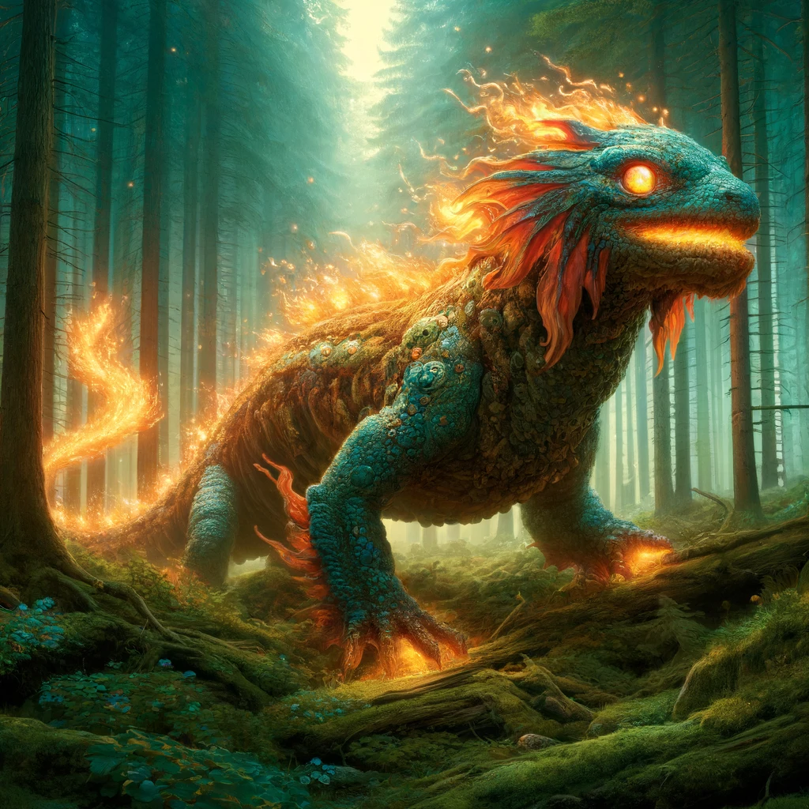
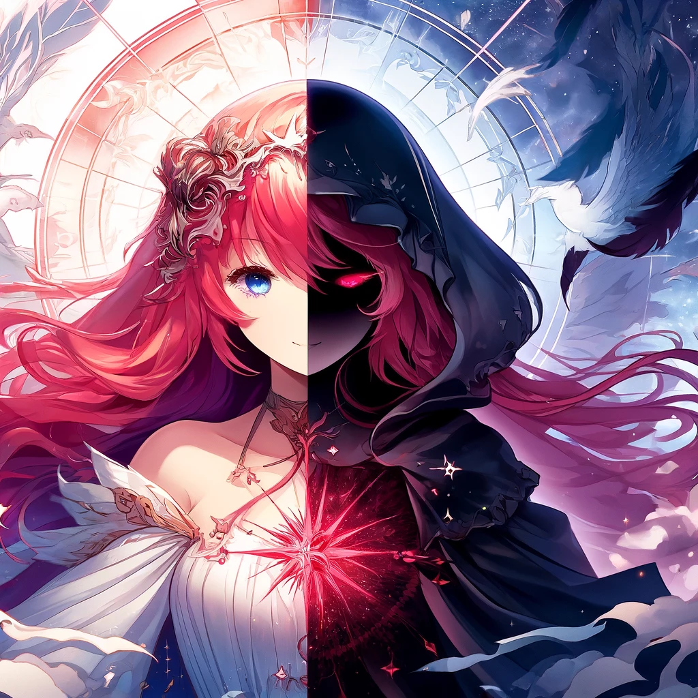
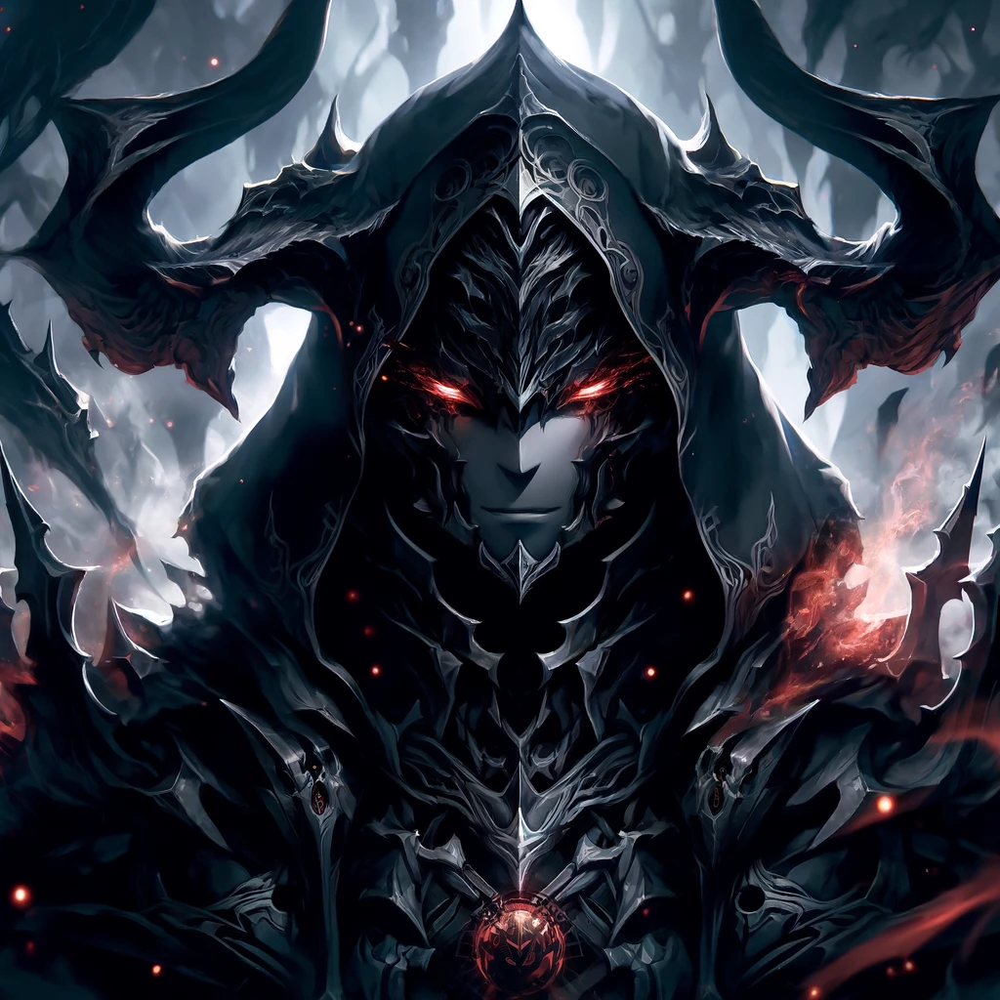
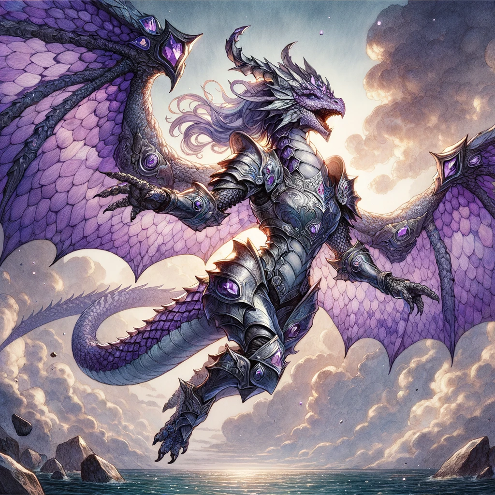
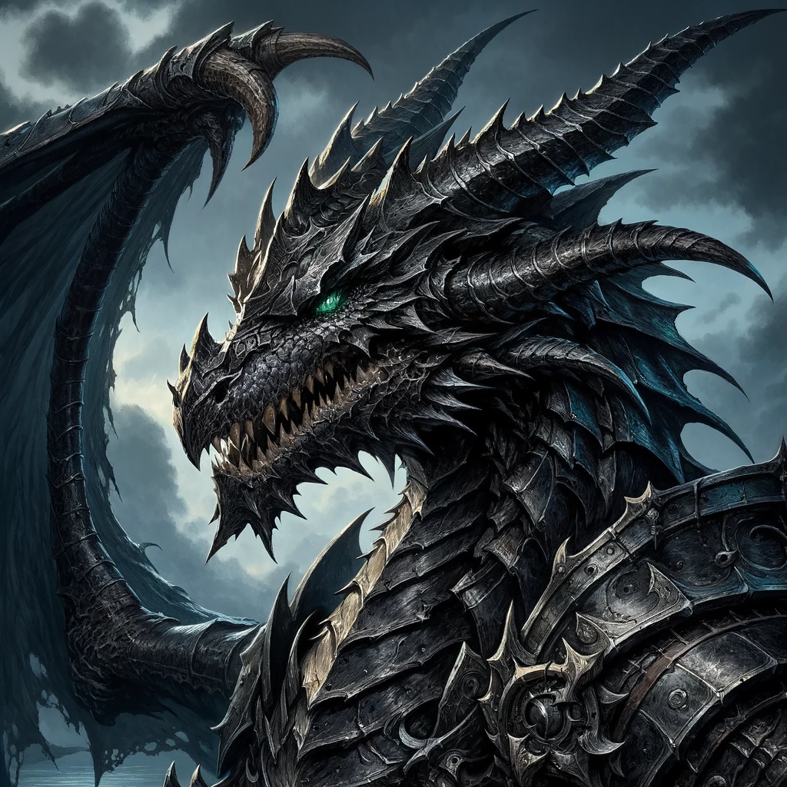
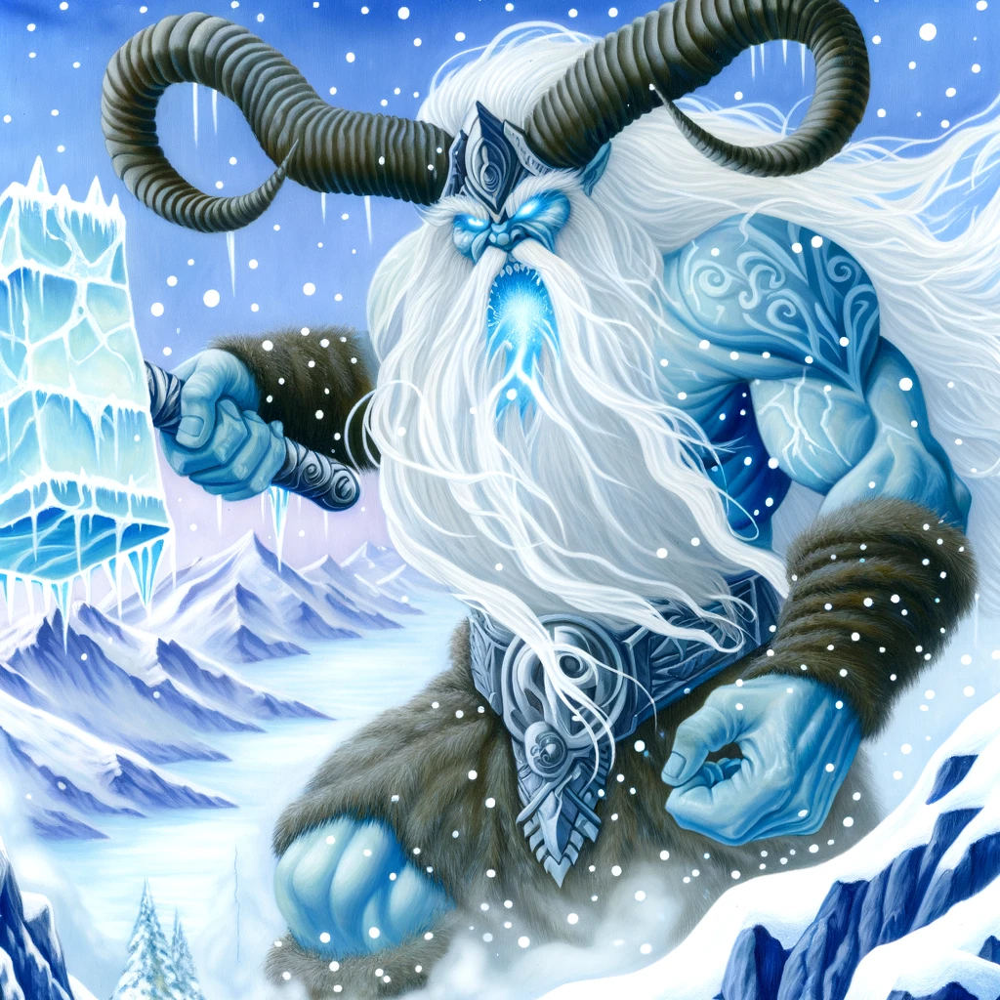

Valeria's divine landscape is a rich tapestry woven from the awe-inspiring figures of the Valerian pantheon, a collection of gods and goddesses who embody the virtues, vices, and the very essence of existence within the realm. 

## Seraphim Archangel

Seraphim Archangel, also known as the ruler of the plane of Aether, is a celestial being of immense power and grace, with wings that gleam like gold and a countenance that radiates divine light. 

His form is that of a great humanoid figure, with skin like burnished brass and hair like spun gold. He wields a flaming sword of great size and power, and his voice is like the sound of a thousand trumpets. 

Seraphim is a paragon of righteousness and goodness, and he serves as a beacon of hope and inspiration to all who seek to do good in the world. His very presence is enough to banish darkness and despair, and his righteous fury can strike down even the most powerful of evil creatures. 

He is a mighty warrior of the heavens, and his deeds have echoed through the ages, inspiring countless generations to stand for what is right and just.

## Inpu
Inpu, known also as the Lord of Embalming and the Keeper of the Dead, appears as a jackal-headed humanoid standing tall with regal bearing. His gleaming black fur contrasts with his gold and blue ceremonial garb, and the precious stones that adorn his scepter and headdress sparkle in the light. 

Inpu is said to possess the knowledge of death and the afterlife, and his presence is both revered and feared. His piercing eyes seem to see through to one's very soul, and his voice carries a weight that speaks of his divine power. 

When he moves, it is with a fluid grace that belies his imposing form, and the sound of his footsteps seems to echo beyond their physical reach. Though his allegiance may be uncertain and his motives often shrouded in mystery, those who have seen him in action know that Inpu is a force to be reckoned with.

## Solomon As-Sajdah
There was an ancient being known as Solomon As-Sajdah, also called the Grim Reaper of souls. He was a being of great power, feared and respected by many, for his duty was to guide the souls of the departed to their final resting place.

His form was tall and cloaked in dark robes that billowed around him like the wings of a great raven. His face was hidden beneath a hood, but the glint of his eyes could be seen even in the deepest darkness. 

Though Solomon As-Sajdah was not a being of malice, his power and duty often drew the attention of dark forces who sought to manipulate the souls of the departed for their own gain. It was said that he was able to see through their deception and would not hesitate to intervene to protect the souls in his care. 

Despite his fearsome appearance, there were some who believed that Solomon As-Sajdah was a being of great compassion. It was said that he had been known to grant mercy to those whose lives had been cut short before their time. 

But those were rare instances, and for the most part, his duty was to ensure that the souls of the departed were carried to their rightful place, regardless of the path that had led them there.

## The Great Salamandria
In the early days of creation, during the great war of the Vale that forged the country from the elemental chaos, there arose a being of flame and fire, a mighty dragon known as the Great Salamandria. With scales that glimmered like the sun and eyes that shone like diamonds, the Salamandria roamed the land, bringing warmth and light to all it touched. 

But the Salamandria was a proud and fierce creature, with a will as strong as the fiery breath that spewed forth from its jaws. It would not be tamed, nor could it be bound, and many feared the destruction it could unleash if it were ever provoked. 

Thus it was that the great Salamandria remained an enigmatic figure throughout the ages, a symbol of both power and danger, revered and feared in equal measure. 

After the war however, it was never to be seen again, researchers theorized his flame was snuffed-out after years of primal chaos. To some, it was a god, to others a demon, but to all it remained a mystery, a creature beyond mortal understanding, and a force of nature that would not be denied.

## Lady Fortuna
In ages past, when the world was young and the fates of mortals were first being woven, there arose a being known as Lady Fortuna. She was said to be a goddess of great power, who held sway over the destinies of all those who walked the earth. 

Her form was shrouded in mystery, for some claimed that she was a radiant figure with flowing scarlet hair, while others spoke of a dark-cloaked woman whose face was hidden in shadow. 

But whatever her true appearance, all who knew of her power and influence revered Lady Fortuna, for she could grant great blessings or terrible curses upon those whom she deemed worthy or unworthy. 

Many sought her favor through prayers and offerings, hoping to sway her to their side and bring them good fortune in their lives. Yet despite her great influence, Lady Fortuna remained an enigma to all those who sought to understand her. 

Some believed that she was simply a force of nature, like the wind or the rain, while others believed that she was a divine being, sent to guide mortals on their journey through life. 

Whatever the truth of her nature, there was no doubting that Lady Fortuna held a special place in the hearts of all who knew of her power and influence.

## Arkus the Horned
In the deepest depths of the infernal planes, amidst the blazing rivers of molten fire and the screams of the damned, he dwells. Arkus the Horned, ruler of the plane of the Nether, was a towering figure, with skin as dark as the shadows he commanded. 

His face was twisted in a permanent sneer, his eyes glowing with malevolence. His horns were jagged and cruel, a physical manifestation of his power over the demonic hordes that followed him. His armor was black as coal, etched with ancient runes of infernal power.

In battle, Arkus was a terrifying sight to behold. He moved with unnatural speed and grace, his blade slicing through the air with a wicked hiss. His spells were potent and destructive, and he could summon creatures from the depths of the abyss to do his bidding. Few who faced him could hope to emerge victorious, and those who did were forever marked by the experience.

Despite his fearsome reputation, Arkus was not without cunning. He was a master manipulator, and his voice was honeyed poison that could sway even the most stalwart of heroes to his cause. He had a network of spies and informants that stretched across the planes, and he was always watching, waiting for an opportunity to strike.

To the people of Nether, Arkus was a god, their patron and protector. They worshiped him with fervor, offering up sacrifices and tribute to gain his favor. But to the rest of the world, he was a force of darkness and destruction, a name to be whispered in terror and despair.

## Reigadyrth
In ancient times, there was a noble dragon known as Reigadyrth, whose scales shone like amethysts in the light. Reigadyrth was wise and just, and her heart was full of compassion for the mortals of the land. 

She saw the struggles of the people and knew that they needed protectors, champions who would fight for their rights and safeguard their lands. And so, Reigadyrth inspired the creation of the order of the Purple Dragon Knights, who would be guided by honor, justice, and the virtues of the dragon.

Reigadyrth was a towering figure, with wings that stretched out to catch the winds and carry him across the skies. Her roar was like thunder, and her flames could turn stone to molten lava. Yet she was also gentle, and spoke with a voice that could calm even the fiercest storm. 

Many knights sought her counsel and guidance, and her wisdom helped them in their quests for justice and righteousness. In the annals of history, Reigadyrth remains a symbol of hope and inspiration. 

She embodied the ideals of the Purple Dragon Knights, and her spirit lives on in the hearts of those who continue to uphold the order's mission to this day.

## Todesfall
In ancient times, Todesfall, the personification of the end of dragons, was a great dragon himself and the brother of the noble Reigadyrth. While Reigadyrth embodied the virtues of honor and justice, Todesfall represented the darker aspects of life and the inevitability of death. 

Todesfall was once a magnificent dragon, but his appearance had been changed by the curse of his own making. His scales had turned black as coal and his once-golden eyes now glowed with a sickly green light. 

His wings, once strong and majestic, were now tattered and ragged, as if they had been burned or torn apart. His snout was long and slender, and his fangs were sharp and deadly. 

As time passed, he watched as his kin were hunted and killed by the various races of the world, until only he and his brother remained. 

When Reigadyrth passed away, Todesfall retreated to a secluded mountain range, where he remains to this day, waiting for the end of his own life and the final death of the dragons. 

Though feared by many, there are those who revere Todesfall as a wise old dragon who has seen the rise and fall of empires and knows the secrets of the world.

## Aegir
In the snowy peaks of Skathi, Aegir reigns supreme as the mightiest of the frost giants. Aegir's form was grand and imposing, much like the mountains that he called home. 

Towering over other beings, his body was adorned with a thick coat of fur that shimmered in the sunlight. His eyes were piercing blue, and his breath came out as icy mist that seemed to freeze the very air around him. 

Large, curved horns protruded from his head, and his claws were sharp as steel. Aegir's presence was both fearsome and awe-inspiring, and many who beheld him felt a deep reverence for the patron of the snow-capped peaks.

Aegir wields a great hammer, crafted from the purest ice and imbued with the power of the frost giants. Each swing of the hammer sends freezing shockwaves through the air, and those struck by it are frozen solid in an instant. 

His eyes glow with an icy blue light, and his breath is like a blizzard, capable of freezing even the hardiest of warriors.

Despite his fearsome appearance and reputation, Aegir is not without honor. He is a just and fair ruler of the frost giants, and he protects his people fiercely. 

Those who are true to their word and keep their oaths will find a stalwart ally in Aegir. But those who would betray him or his people will feel the full fury of the mightiest of the frost giants.